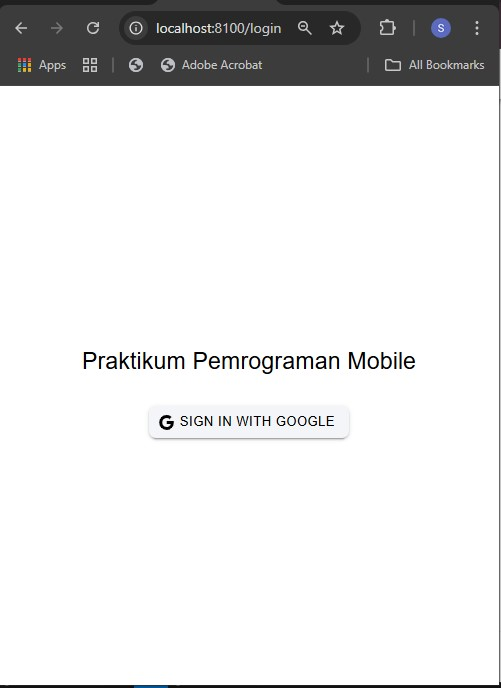
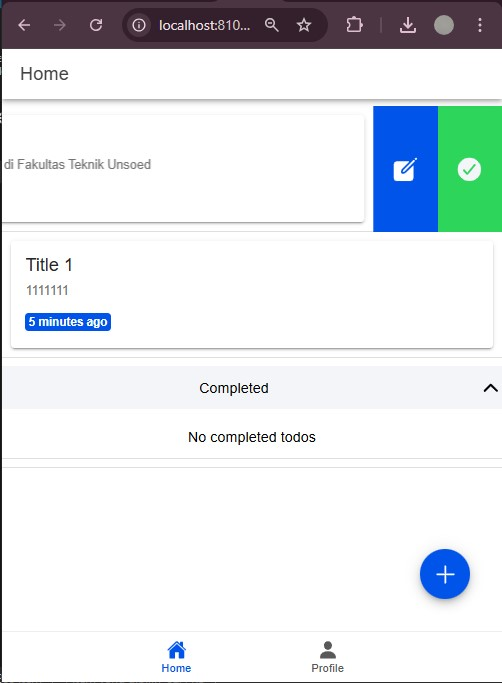
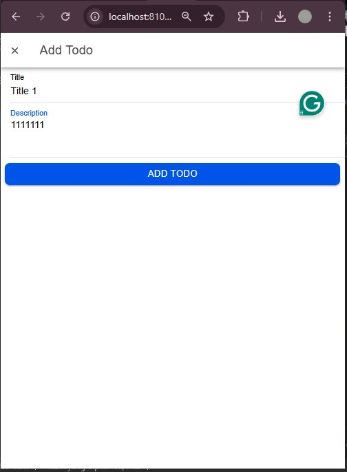
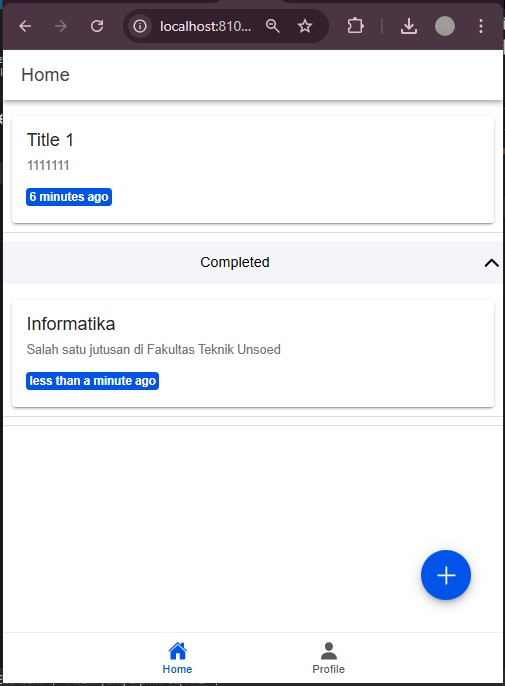
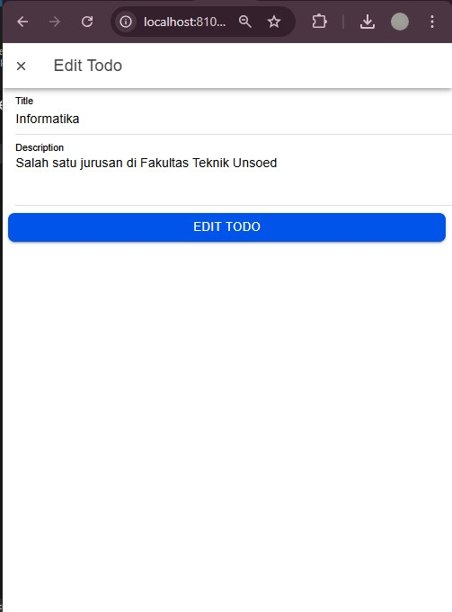
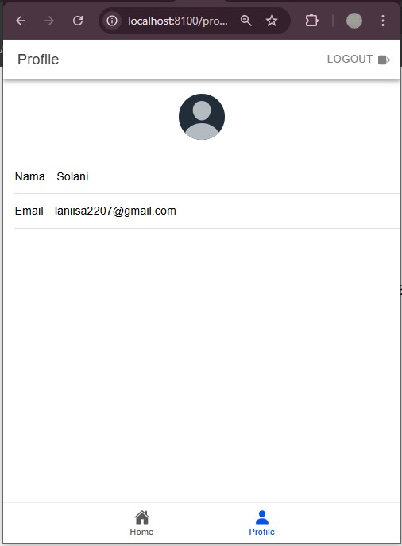

# SOLANI_H1D022033_IonicVueFirebase-
Praktikum Mobile Ionic Vue Firebase 

Halaman Login

Berikut tampilan halaman login sign with google

Halaman Home

Berikut tampilan halaman home yang menampilkan daftar data yang berhasil dimuat dari database

Halaman Tambah Data

Berikut tampilan halaman  proses membuat data baru di web tersebut. Formulir input digunakan untuk menambahkan data, dan tombol "ADD TODO" akan menyimpan data ke database.

Berikut tampilan halaman home completed

Berikut tampilan halaman yang menunjukkan proses mengubah data yang ada. Formulir edit ditampilkan dengan data lama yang diisi secara otomatis, dan pengguna dapat memperbaruinya.

Berikut halaman profile yang berisi nama serta email

Penjelasan terkait cara dari mulai autentikasi login, hingga aplikasi mendapatkan username dan profil kita dari akun google : 

1. Membuat Store untuk Autentikasi (auth.ts)
Pada src/stores/auth.ts, mendefinisikan Pinia store untuk mengelola autentikasi.
- ref<User | null>(null);: Menyimpan informasi pengguna yang didapatkan dari Firebase, termasuk username, email, dan URL foto profil.
- isAuth: Komputasi yang akan mengembalikan true jika pengguna sudah login, berdasarkan apakah user memiliki nilai atau null.

2. Login dengan Google (loginWithGoogle function)
Fungsi loginWithGoogle menangani proses autentikasi dengan Google. 
- GoogleAuth.initialize: Inisialisasi GoogleAuth dengan client ID Google dan hak akses untuk profil dan email.
- GoogleAuth.signIn(): Melakukan autentikasi Google dan menerima objek googleUser, yang berisi informasi pengguna serta token autentikasi (idToken).
- GoogleAuthProvider.credential(idToken): Mengonversi idToken ke dalam credential yang dapat dikenali Firebase.
- signInWithCredential(auth, credential): Login pengguna menggunakan credential Google di Firebase. Setelah berhasil, Firebase menyimpan informasi pengguna ke result.user.

3. Mengelola Status Autentikasi Pengguna (onAuthStateChanged)
Firebase menyediakan fungsi onAuthStateChanged yang akan memeriksa status autentikasi setiap kali terjadi perubahan (login atau logout).
- Saat pengguna login atau logout, user.value akan diperbarui sesuai informasi terbaru.
- Jika login berhasil, user akan memiliki nilai data pengguna (contoh: displayName, email, photoURL).

4. Menggunakan Data Pengguna di Komponen Vue
Setelah login berhasil, menggunakan authStore untuk mengakses data profil pengguna di komponen seperti ProfilePage.vue.
- authStore.user: Menyimpan informasi pengguna yang berhasil login, termasuk nama pengguna (displayName), email (email), dan foto profil (photoURL).

5. Menampilkan Profil Pengguna di Halaman Profil (ProfilePage.vue)
Di ProfilePage.vue, menampilkan data displayName dan email dari akun Google pengguna.
- Avatar Foto Profil: Jika foto profil pengguna gagal dimuat, handleImageError akan menggantinya dengan avatar default.
- Data Profil: displayName dan email diambil dari user yang terautentikasi dan ditampilkan dalam elemen input sebagai informasi yang tidak bisa diubah (readonly="true").

6. Mengarahkan Pengguna Berdasarkan Status Login
Router di router/index.ts menggunakan beforeEach untuk memeriksa apakah pengguna sudah login atau belum. Ini memastikan halaman yang memerlukan autentikasi hanya bisa diakses oleh pengguna yang login.
- to.meta.isAuth: Jika rute memerlukan autentikasi (isAuth: true), maka pengguna diarahkan ke /login jika belum login.
- authStore.isAuth: Mengecek status autentikasi, mencegah pengguna kembali ke halaman login jika sudah login.

